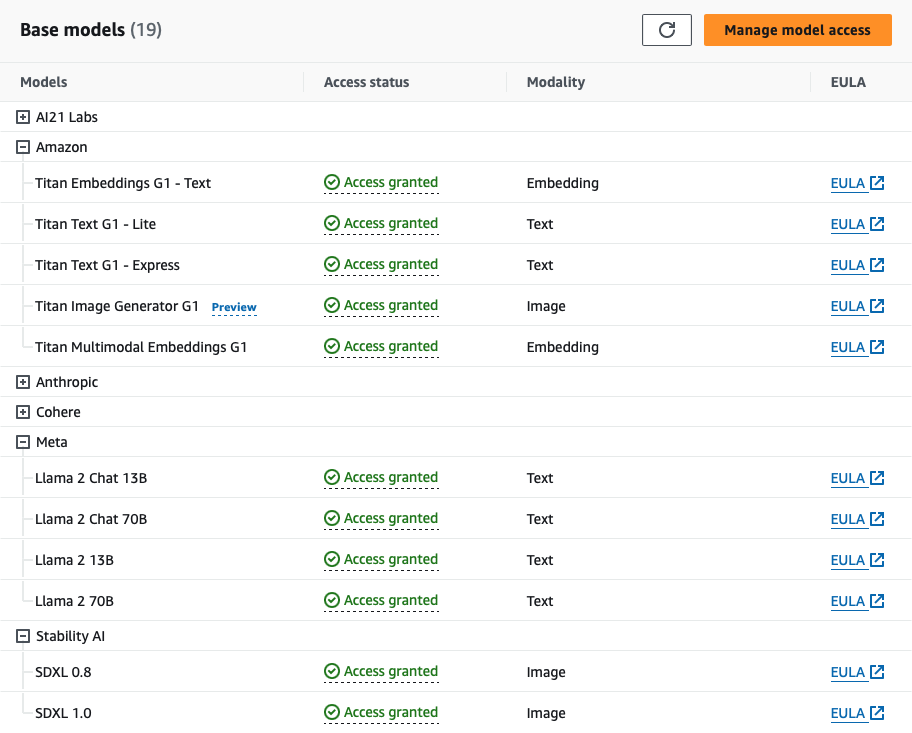

# Ruby Amazon Bedrock

[](https://badge.fury.io/rb/ruby-amazon-bedrock)
[](https://dl.circleci.com/status-badge/redirect/circleci/JP4R1PDyZ2Yax5GxVQoMZN/LAwrE89wMVTrgpfzaimon/tree/main)

Seamless Integration with Amazon Bedrock API for AI-Powered Text and Image Generation in Ruby 🤖 + 💎. [Amazon Bedrock API](https://aws.amazon.com/es/bedrock/).

Amazon Bedrock is a fully managed service that makes FMs from leading AI startups and Amazon available via an API, so you can choose from a wide range of FMs to find the model that is best suited for your use case.

## Installation

### Bundler

Add the following line to your application's Gemfile:

```ruby
gem "ruby-amazon-bedrock", "~> 0.2.3"
```

And then execute:

```bash
$ bundle install
```

### Gem install

Or install with:

```bash
$ gem install ruby-amazon-bedrock -v 0.2.3
```

and require with:

```ruby
require "amazon_bedrock"
```

## Credentials

In order to use Amazon Bedrock, you'll need your secure credentials just as any other AWS service. Get your keys from AWS IAM (Identity and Access Management) [https://us-east-1.console.aws.amazon.com/iam](https://us-east-1.console.aws.amazon.com/iam)

## Model access

To use Bedrock, you must [request access to Bedrock's FMs](https://us-east-1.console.aws.amazon.com/bedrock/home?region=us-east-1#/modelaccess). To do so, you will need to have the correct IAM Permissions. For certain models, you may first need to submit use case details before you are able to request access.



## Model pricing

Be aware that by using `ruby-amazon-bedrock` gem in conjunction with Amazon Bedrock, you may incur costs associated with the use of Amazon Bedrock services. As the user, you are solely responsible for any and all costs that arise from your use of Amazon Bedrock. You can see more details about pricing [here](https://aws.amazon.com/bedrock/pricing/)

## Quickstart

Instantiate a client by passing your AWS IAM credentials:

```ruby
client = RubyAmazonBedrock::Client.new(
  region: "AWS_REGION",
  access_key_id: "AWS_ACCESS_KEY_ID",
  access_token: "AWS_SECRET_ACCESS_KEY"
)
```

### AWS Named Profiles

You can also use [AWS Named Profiles](https://docs.aws.amazon.com/cli/latest/userguide/cli-configure-files.html#cli-configure-files-format-profile):

```ruby
client = RubyAmazonBedrock::Client.new(
  profile: 'dev' 
)
```

This will default to the value of the `$AWS_PROFILE` environment variable and will take precidence over key/token keys.  If for some reason you have `$AWS_PROFILE` defined in your environment _and you do not want to use it_ then you can disable by passing an empty string and specifying your region/key/secret as usual:

```ruby
client = RubyAmazonBedrock::Client.new(
  profile: "",            # Disable named profile
  region: "AWS_REGION",
  access_key_id: "AWS_ACCESS_KEY_ID",
  access_token: "AWS_SECRET_ACCESS_KEY"
)
```

## With Configuration

```ruby
RubyAmazonBedrock.configure do |config|
  # You don't need to specify these lines to default to the environment variables, these lines are provided for illustrative purposes only
  config.profile = ENV.fetch('AWS_PROFILE', nil)
  config.region = ENV.fetch('AWS_REGION', nil)
  config.access_key_id = ENV.fetch('AWS_ACCESS_KEY_ID', nil)
  config.secret_access_key = ENV.fetch('AWS_SECRET_ACCESS_KEY', nil)
end

client = RubyAmazonBedrock::Client.new
```

## Options

The options argument enhances the method's flexibility by allowing additional, model-specific configurations. If not explicitly provided, the method defaults to a set of standard Model parameters. You can see more details about a Model's optional parameters.

## Model Providers

Amazon Bedrock is a fully managed service that makes FMs from leading AI startups and Amazon available via an API, so you can choose from a wide range of FMs to find the model that is best suited for your use case.

### AI21 Labs

Businesses use AI21's Jurassic family of leading LLMs to build generative AI-driven applications and services leveraging existing organizational data. Jurassic supports cross-industry use cases including long and short-form text generation, contextual question answering, summarization, and classification. Designed to follow natural language instructions, Jurassic is trained on a massive corpus of web text and supports six languages in addition to English. [See more ...](https://us-east-1.console.aws.amazon.com/bedrock/home?region=us-east-1#/providers?model=ai21.j2-ultra-v1)

Options for these models are:

```ruby
  {
    temperature: 0.5,     # float
    max_tokens: 200,      # integer
    stop_sequences: [],   # [string]
    top_p: 0.5,           # float
    count_penalty: 0,     # integer
    presence_penalty: 0,  # integer
    frequency_penalty: 0  # integer
  }
```

For more documentation about the parameter data types and values you can [See more details...][https://docs.aws.amazon.com/bedrock/latest/userguide/model-parameters-jurassic2.html]

How to call AI21 models:

_*Jurassic-2 Ultra*_

Supports: Open book question answering, summarization, draft generation, information extraction, ideation

Languages: English, Spanish, French, German, Portuguese, Italian, Dutch

```ruby
client.invoke_model(id: 'ai21.j2-ultra-v1', prompt: "What's natural language processing?", options: {})

# Response
{:id=>1234,
 :prompt=>
  {:text=>"Describe how an LLM works",
   :tokens=>
    [{:generatedToken=>{:token=>"▁Describe", :logprob=>-10.674324035644531, :raw_logprob=>-10.674324035644531},
 :completions=>
  [{:data=>
    {:text=>
       "\nNatural language processing (NLP) is a field of computer science, artificial intelligence, and linguistics concerned with the interactions between computers and human (natural) languages, in particular how to program computers to process and analyze large amounts of natural language data. The goal of NLP is to provide computers with the ability to read, understand, and generate human language.",
      :tokens=>
       [{:generatedToken=>{:token=>"<|newline|>", :logprob=>0.0, :raw_logprob=>-0.00046850196667946875},
```

_*Jurassic-2 Mid*_

```ruby
client.invoke_model(id: 'ai21.j2-mid-v1', prompt: "What's GenAI?", options: {})

# Response
{:id=>1234,
 :prompt=>
  {:text=>"What's GenAI?",
   :tokens=>
    [{:generatedToken=>{:token=>"▁What's", :logprob=>-9.553738594055176, :raw_logprob=>-9.553738594055176},
      :topTokens=>nil,
      :textRange=>{:start=>0, :end=>6}},
 :completions=>
  [{:data=>
     {:text=>
       "\nGenAI is a proposed standard for a generic AI language, which would allow AI systems to communicate and reason with each other in a common language. The goal of GenAI is to create a universal language that can be used by all AI systems, regardless of their specific task or underlying architecture. This would make it easier for AI systems to work together and learn from each other, and it would also make it easier for humans to interact with and understand AI systems.",
      :tokens=>
       [{:generatedToken=>{:token=>"<|newline|>", :logprob=>0.0, :raw_logprob=>-0.0009662011871114373},
```

### Amazon Titan

Amazon Titan Foundation Models are pre-trained on large datasets, making them powerful, general-purpose models. Use them as is, or customize them by fine tuning the models with your own data for a particular task without annotating large volumes of data. [See more ...](https://us-east-1.console.aws.amazon.com/bedrock/home?region=us-east-1#/providers?model=amazon.titan-embed-text-v1)

Options for these models are:

```ruby
  {
    temperature: 0.5,   # float
    top_p: 0.5,         # float
    max_tokens: 512,    # integer
    stop_sequences: []  # [string]
  }
```

For more documentation about the parameter data types and values you can [See more details...][https://docs.aws.amazon.com/bedrock/latest/userguide/model-parameters-titan-text.html]

How to call Amazon Titan text models:

_*Titan Text G1 - Lite*_

[https://us-east-1.console.aws.amazon.com/bedrock/home?region=us-east-1#/providers?model=amazon.titan-text-lite-v1](https://us-east-1.console.aws.amazon.com/bedrock/home?region=us-east-1#/providers?model=amazon.titan-text-lite-v1)

Supports: Text generation, Code generation, Rich text formatting, Orchestration (Agents), Fine Tuning.

```ruby
client.invoke_model(id: 'amazon.titan-text-lite-v1', prompt: 'Generate a story about rubies and gems', options: {})

# Response
{:inputTextTokenCount=>8,
 :results=>
  [{:tokenCount=>294,
    :outputText=>
     "\nOnce upon a time, there was a king who was very fond of rubies and gems. He had a collection of the most beautiful rubies and gems ...",
    :completionReason=>"FINISH"}]}
```

_*Titan Text G1 - Express*_

[https://us-east-1.console.aws.amazon.com/bedrock/home?region=us-east-1#/providers?model=amazon.titan-text-express-v1](https://us-east-1.console.aws.amazon.com/bedrock/home?region=us-east-1#/providers?model=amazon.titan-text-express-v1)

```ruby
client.invoke_model(id: 'amazon.titan-text-express-v1', prompt: 'Generate a post about cats formatted with HTML tags', options: {})

# Response
{:inputTextTokenCount=>9,
 :results=>
  [{:tokenCount=>330,
    :outputText=>
     "\n<h1>Cats</h1>\n\nCats are small, furry, carnivorous mammals that are loved by many people around the world. They come in a variety of colors, shapes, and sizes, and have unique personalities that make them great companions.\n\n",
    :completionReason=>"FINISH"}]}
```

Supports: Text generation, Code generation, Rich text formatting, Orchestration (Agents), Fine Tuning

### Anthropic

Anthropic offers the Claude family of large language models purpose built for conversations, summarization, Q&A, workflow automation, coding and more. Early customers report that Claude is much less likely to produce harmful outputs, easier to converse with, and more steerable - so you can get your desired output with less effort. Claude can also take direction on personality, tone, and behavior.

Options for these models are:

```ruby
  {
    temperature: 0.3,   # float
    top_p: 0.5,         # float
    top_k: 0.5,         # float
    max_tokens: 1000,   # integer
    stop_sequences: []  # [string]
  }
```

For more documentation about the parameter data types and values you can [See more details...][https://docs.aws.amazon.com/bedrock/latest/userguide/model-parameters-claude.html]

How to call Anthropic models:

_*Claude Instant 1.2*_

[https://us-east-1.console.aws.amazon.com/bedrock/home?region=us-east-1#/providers?model=anthropic.claude-instant-v1](https://us-east-1.console.aws.amazon.com/bedrock/home?region=us-east-1#/providers?model=anthropic.claude-instant-v1)

Supports: Question answering, information extraction, removing PII, content generation, multiple choice classification, Roleplay, comparing text, summarization, document Q&A with citation

```ruby
client.invoke_model('anthropic.claude-instant-v1', 'What is a neural network?')

# Response
{:completion=>
  " A neural network is a type of machine learning model inspired by the human brain. The key elements of neural networks are:\n\n- Neurons..."
 :stop_reason=>"stop_sequence",
 :stop=>"\n\nHuman:"}
```

<br>

_*Claude 1.3*_

[https://us-east-1.console.aws.amazon.com/bedrock/home?region=us-east-1#/providers?model=anthropic.claude-v1](https://us-east-1.console.aws.amazon.com/bedrock/home?region=us-east-1#/providers?model=anthropic.claude-v1)

Supports: Question answering, [information extraction](https://docs.anthropic.com/claude/docs/text-processing), removing PII, content generation, [multiple choice classification](https://docs.anthropic.com/claude/docs/multiple-choice-and-classification), [Roleplay](https://docs.anthropic.com/claude/docs/roleplay-dialogue), comparing text, summarization, [document Q&A with citation](https://docs.anthropic.com/claude/docs/advanced-text-analysis)

```ruby
client.invoke_model(id: 'anthropic.claude-v1', prompt: "You will be acting as a AI customer success agent for a company called Acme Dynamics.")

# Response
{:completion=>
  " Okay, thanks for providing the context. My name is Claude, I'm an AI assistant created by Anthropic to be helpful, harmless, and honest. How can I assist you as a customer success agent for Acme Dynamics today?",
 :stop_reason=>"stop_sequence",
 :stop=>"\n\nHuman:"}
```

<br>

_*Claude 2*_

[https://us-east-1.console.aws.amazon.com/bedrock/home?region=us-east-1#/providers?model=anthropic.claude-v2](https://us-east-1.console.aws.amazon.com/bedrock/home?region=us-east-1#/providers?model=anthropic.claude-v2)

Supports: Question answering, [information extraction](https://docs.anthropic.com/claude/docs/text-processing), removing PII, content generation, [multiple choice classification](https://docs.anthropic.com/claude/docs/multiple-choice-and-classification), [Roleplay](https://docs.anthropic.com/claude/docs/roleplay-dialogue), comparing text, summarization, [document Q&A with citation](https://docs.anthropic.com/claude/docs/advanced-text-analysis)

```ruby
client.invoke_model(id: 'anthropic.claude-v2', prompt: "I'm going to provide some text. I want to remove all person
ally identifying information from this text and replace it with XXX. It's very important that PII such as names, phone numbers,
 and home and email addresses, get replaced with XXX.")

# Response
{:completion=>
  " Here is the text with personally identifying information replaced with XXX:\n\nXXX lives at XXX in the city of XXX. XXX can be reached at phone...",
 :stop_reason=>"stop_sequence",
 :stop=>"\n\nHuman:"}
```

### Cohere

Cohere models are text generation models for business use cases. Cohere models are trained on data that supports reliable business applications, like text generation, summarization, copywriting, dialogue, extraction, and question answering.

Options for command models are:

```ruby
  {
    temperature: 0.3,           # float
    top_p: 0.5,                 # float
    top_k: 0.5,                 # float
    max_tokens: 1000,           # integer
    stop_sequences: [],         # [string]
    num_generations: 2,         # integer
    return_likelihoods: 'ALL',  # string
    stream: true,               # boolean
    truncate: 'END'             # srtring
  }
```

For more documentation about the parameter data types and values you can [See more details...][https://docs.aws.amazon.com/bedrock/latest/userguide/model-parameters-cohere-command.html]

How to call Cohere command models:

_*Command*_

[https://us-east-1.console.aws.amazon.com/bedrock/home?region=us-east-1#/providers?model=cohere.command-text-v14](https://us-east-1.console.aws.amazon.com/bedrock/home?region=us-east-1#/providers?model=cohere.command-text-v14)

Supports: Summarization, copywriting, dialogue, extraction, and question answering.

```ruby
client.invoke_model(id: 'cohere.command-text-v14', prompt: 'Generate a twit about why Ruby on Rails is a great tool for building a startup. Write a few hashtags')

# Response
{:generations=>
  [{:finish_reason=>"COMPLETE",
    :id=>"b82658a5-8f36-4a94-a1f1-7802aa418904",
    :text=>
     " Sure! Here's a tweet:\n\nRuby on Rails is a powerful framework for building web applications. It is highly scalable, has robust community support, and is the perfect choice for startups looking to build fast and ship often. #RoR #RubyOnRails #Startup #Tech #Efficient \n\nWhat do you think?"}],
 :id=>"d5d5149f-ea5a-47ae-ae37-8324882b06c7",
 :prompt=>"Generate a twit about why Ruby on Rails is a great tool for building a startup. Write a few hashtags:"}
```

<br>

_*Command Light*_

[https://us-east-1.console.aws.amazon.com/bedrock/home?region=us-east-1#/providers?model=cohere.command-light-text-v14](https://us-east-1.console.aws.amazon.com/bedrock/home?region=us-east-1#/providers?model=cohere.command-light-text-v14)

Supports: Summarization, copywriting, dialogue, extraction, and question answering.

```ruby
client.invoke_model(id: 'cohere.command-light-text-v14', prompt: 'Generate a facebook post about GenAI models available at Amazon Bedrock')

# Response
{:generations=>
  [{:finish_reason=>"MAX_TOKENS",
    :id=>"b58eaa37-915e-4f26-b37c-6b4875516648",
    :text=>
     " Introducing the latest innovation at Amazon Bedrock - our state-of-the-art GenAI models! 🤖💡\n\nOur team has been working tirelessly to bring you the best in artificial intelligence, and we're excited to share the results with you. With our GenAI models, you can now:\n\n- Develop applications that can understand and respond to human language with incredible accuracy, thanks to our state-of-the-art Large Language Models (LLMs).\n-"}],
 :id=>"0d2f2c74-cae9-434b-b5d5-f44aaeb1a587",
 :prompt=>"Generate a facebook post about GenAI models available at Amazon Bedrock:"}
```

Options for embed models are:

```ruby
  {
    input_type: 'classification', # string
    truncate: 'END'               # string
  }
```

For more documentation about the parameter data types and values you can [See more details...][https://docs.aws.amazon.com/bedrock/latest/userguide/model-parameters-embed.html]

How to call Cohere embed models:

_*Embed English*_

[https://us-east-1.console.aws.amazon.com/bedrock/home?region=us-east-1#/providers?model=cohere.embed-english-v3](https://us-east-1.console.aws.amazon.com/bedrock/home?region=us-east-1#/providers?model=cohere.embed-english-v3)

Supports: Semantic search, retrieval-augmented generation (RAG), classification, clustering.

```ruby
# WIP
# client.invoke_model(id: 'cohere.embed-english-v3', prompt: 'Your prompt goes here ...')
```

<br>

_*Embed Multilingual*_

[https://us-east-1.console.aws.amazon.com/bedrock/home?region=us-east-1#/providers?model=cohere.embed-multilingual-v3](https://us-east-1.console.aws.amazon.com/bedrock/home?region=us-east-1#/providers?model=cohere.embed-multilingual-v3)

```ruby
# WIP
# client.invoke_model(id: 'cohere.embed-multilingual-v3', prompt: 'Your prompt goes here ...')
```

### Meta

Meta is looking to unlock the power of large language models. Our latest version of Llama is now accessible to individuals, creators, researchers and businesses of all sizes so that they can experiment, innovate and scale their ideas responsibly.

Options for these models are:

```ruby
  {
    max_tokens: 128,  # integer
    temperature: 0.9, # float
    top_p: 0.7        # float
  }
```

How to call Meta models:

_*Llama 2 Chat 13B*_

[https://us-east-1.console.aws.amazon.com/bedrock/home?region=us-east-1#/providers?model=meta.llama2-13b-chat-v1](https://us-east-1.console.aws.amazon.com/bedrock/home?region=us-east-1#/providers?model=meta.llama2-13b-chat-v1)

Supports: Llama 2 is intended for commercial and research use in English. Fine-tuned chat models are intended for chat based applications.

```ruby
client.invoke_model(id: 'meta.llama2-13b-chat-v1', prompt: 'Generate an Instagram Post about the Metaverse')

# Resopnse
{:generation=>
  "\n\nHey #Instagram community! 👋 I'm super excited to share my latest discovery with you all - the #Metaverse! 🤯🌐\n\nHave you heard of it? It's like a virtual world where you can be anyone and do anything! 😍 From exploring new planets to attending virtual concerts, the possibilities are endless! 🎉\n\nI've been spending some time in the #Metaverse lately, and let me tell you, it's a game changer! 🔥 Not only is it a ton of fun, but it's also a great way to connect with people from all over the world. 🌎\n\nI've made some amazing friends in the #Metaverse, and we've had some incredible adventures together! 🤝🌟\n\nSo, what are you waiting for? Come join me in the #Metaverse and let's explore this amazing virtual world together! 😄👋\n\n#Metaverse #VirtualReality #VR #Gaming #Adventure #Fun #Community #Friends #Instagram #SocialMedia",
 :prompt_token_count=>11,
 :generation_token_count=>275,
 :stop_reason=>"stop"}
```

<br>

_*Llama 2 Chat 70B*_

[https://us-east-1.console.aws.amazon.com/bedrock/home?region=us-east-1#/providers?model=meta.llama2-70b-chat-v1](https://us-east-1.console.aws.amazon.com/bedrock/home?region=us-east-1#/providers?model=meta.llama2-70b-chat-v1)

Supports: Llama 2 is intended for commercial and research use in English. Fine-tuned chat models are intended for chat based applications.

```ruby
client.invoke_model(id: 'meta.llama2-70b-chat-v1', prompt: 'Generate a Facebook add to promote a new website that is selling Ruby on Rails and AI courses')

# Response
{:generation=>
  ".\n\nThe ad should be targeted at people who are interested in learning Ruby on Rails and AI, and should highlight the benefits of taking the courses on the website.\n\nHere is a sample ad that could be used to promote the website:\n\nHeadline: Unlock Your Potential with Ruby on Rails and AI Courses\n\nBody: Are you interested in learning Ruby on Rails and AI? Look no further! Our website offers a range of courses that will teach you everything you need to know to get started with these exciting technologies.\n\nOur Ruby on Rails courses will show you how to build powerful web applications using the popular framework, while our AI courses will teach you the fundamentals of machine learning and deep learning. ...",
 :prompt_token_count=>22,
 :generation_token_count=>512,
 :stop_reason=>"length"}
```

### Stability AI

Stability AI is the world's leading open-source generative artificial intelligence company, collaborating with public and private sector partners to bring next generation infrastructure to a global audience.

Options for these models are:

```ruby
  {
    cfg_scale: 20,  # integer
    seed: 1,        # integer
    steps: 10       # integer
  }
```

How to call Stability AI models:

_*SDXL 0.8*_

[https://us-east-1.console.aws.amazon.com/bedrock/home?region=us-east-1#/providers?model=stability.stable-diffusion-xl-v0](https://us-east-1.console.aws.amazon.com/bedrock/home?region=us-east-1#/providers?model=stability.stable-diffusion-xl-v0)

Supports: image generation, image editing

```ruby
client.invoke_model(id: 'stability.stable-diffusion-xl-v0', prompt: 'Generate an image of an orca jumping out of the water', options: { file_path: 'path/to/your/image.jpg' })
# NOTE: If file_path is not provided the image will be saved at 'image.jpg'

# Success Response
{
  result: :success,
  file_path: 'path/to/your/image.jpg'
}

# Failure Response
{
  result: :failure,
  error: ErrorClass
}
```

Example generated image


<br>

_*SDXL 1.0*_

```ruby
client.invoke_model(id: 'stability.stable-diffusion-xl-v1', prompt: 'Generate an image of a white gold ring with a ruby on it', options: { file_path: 'path/to/your/image.jpg' })
# NOTE: If file_path is not provided the image will be saved at 'image.jpg'

# Success Response
{
  result: :success,
  file_path: 'path/to/your/image.jpg'
}

# Failure Response
{
  result: :failure,
  error: ErrorClass
}

```

Example generated image


<!-- ## Contributing

Bug reports and pull requests are welcome on GitHub at <https://github.com/AAlvAAro/ruby-amazon-bedrock>. -->

<!-- ## Code of Conduct

Everyone interacting in the Ruby Amazon Bedrock project's codebases, issue trackers, chat rooms and mailing lists is expected to follow the [code of conduct](https://github.com/AAlvAAro/ruby-amazon-bedrock/blob/main/CODE_OF_CONDUCT.md). -->
